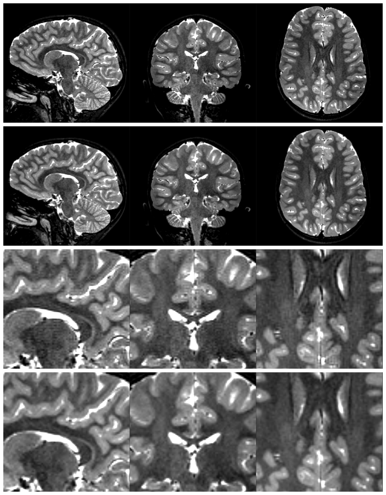

[](https://www.python.org/downloads/release/python-31111/)
[](https://pytorch.org/get-started/locally/)
[](https://pytorchlightning.ai/)
[](https://flake8.pycqa.org/en/latest/)


# Medical Image Processing using Kolmogorov-Arnold Networks



## 📌 Workspace
```
└── $WORKBENCH
    ├── ckpts
    ├── data_lists
    ├── runs
    └── MedicalKAN
        ├── configs
        │   └── *.yaml
        ├── requirements
        ├── src
        │   ├── data
        │   ├── models
        │   ├── nn
        │   ├── trainers
        │   └── utils
        ├── .flake8
        ├── .gitignore
        ├── README.md
        └── train.py
```

## 📌 Quick-start
```
> cd ~
> git clone https://github.com/MaksimPenkin/MedicalKAN.git
> cd MedicalKAN
> export WORKBENCH=<...>
> export DATASETS=<...>
> python3 train.py --help

Command-line arguments:
usage: train.py [-h]

Command-line arguments

options:
  -h, --help        show this help message and exit
  --use_gpu         gpu index to be used.
  --seed            manual seed to be used.
  --engine          engine specification.
  --epochs          how many times to iterate over the dataset (default: 1).
  --limit_batches   how much of the dataset to use (default: 1.0).
```

## Acknowledgements
Big thank you for the awesome works!

| arXiv                                                                                        | GitHub                                                                            |
|----------------------------------------------------------------------------------------------|-----------------------------------------------------------------------------------|
| [KAN: Kolmogorov-Arnold Networks](https://arxiv.org/pdf/2404.19756)                          | [GitHub-pykan](https://github.com/KindXiaoming/pykan)                             |
| [Convolutional Kolmogorov–Arnold Networks](https://arxiv.org/pdf/2406.13155v1)               | [GitHub-Convolutional-KANs](https://github.com/AntonioTepsich/Convolutional-KANs) |
| [Chebyshev Polynomial-Based Kolmogorov-Arnold Networks](https://arxiv.org/html/2405.07200v1) | [GitHub-Chebyshev-KANs](https://github.com/SynodicMonth/ChebyKAN)                 |
|                                                                                              | [GitHub-X-KANeRF](https://github.com/lif314/X-KANeRF)                                                                        |


## Citation
```python
@inproceedings{penkin2024kolmogorov,
  title={Kolmogorov-Arnold Networks as Deep Feature Extractors for MRI Reconstruction},
  author={Penkin, Maksim and Krylov, Andrey},
  booktitle={Proceedings of the 2024 9th International Conference on Biomedical Imaging, Signal Processing},
  pages={92--97},
  year={2024}
}
```
